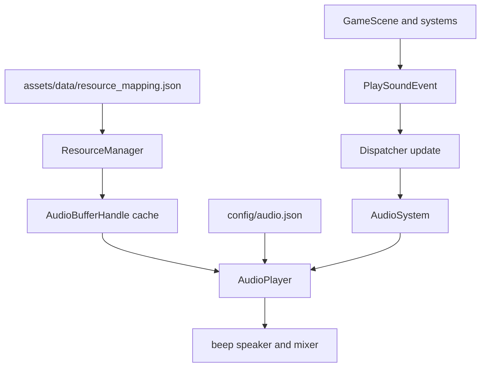

# 音频系统路线图

## 目标

当前 Go 版本先对齐 `copy_source/TinyFarm` 第 16 节的音频主线，建立一个可运行、可测试、边界清晰的音频系统。

本阶段重点不是逐行复制 C++ 的 miniaudio API，而是迁移它的职责划分和运行语义：

- `ResourceManager` 负责把资源 key 预加载成音频缓存
- `AudioPlayer` 负责把缓存变成播放实例，并管理音量、音乐和空间化参数
- `AudioSystem` 负责把事件转换成播放调用
- 游戏层优先只发事件或调用窄口 API，不直接接触解码器和底层播放设备

首版不提前迁移 Debug UI、资源热重载、完整 3D 空间声和复杂淡入淡出管理。先保证音效、背景音乐、配置、事件播放和 2D 空间声形成闭环。

## 当前状态

- `assets/data/resource_mapping.json` 已包含 `sound`、`music` 和 `texture` 三类资源映射
- `engine/resource/resourceManager.go` 已创建 `audioManager`，并在 `LoadResources` 中预加载 sound/music
- `engine/resource/audioManager.go` 已使用 `github.com/gopxl/beep/v2` 解码 wav、mp3 和 ogg，并缓存为 `AudioBufferHandle`
- `engine/core/gameApp.go` 已初始化 SDL Audio 子系统，并在启动阶段创建 `ResourceManager`
- `engine/utils/dispatch/dispatch.go` 已提供 `Trigger`、`Enqueue`、`Update` 的事件派发语义
- `engine/context/context.go` 当前还没有暴露 AudioPlayer
- Go 侧还没有 `engine/audio` 包、`AudioPlayer`、`PlaySoundEvent` 和 `AudioSystem`

当前资源层已经完成了 copy_source 里 `AudioManager` 的主要职责，下一步应进入播放层，而不是继续扩大资源层。

## 参考范围

教程入口：

- `https://cppgamedev.top/courses/opengl-tiny-farm/parts/part-16`

本地参考项目优先阅读：

- `copy_source/TinyFarm/docs/audio_system.md`
- `copy_source/TinyFarm/src/engine/resource/audio_manager.h`
- `copy_source/TinyFarm/src/engine/resource/audio_manager.cpp`
- `copy_source/TinyFarm/src/engine/audio/audio_player.h`
- `copy_source/TinyFarm/src/engine/audio/audio_player.cpp`
- `copy_source/TinyFarm/src/engine/system/audio_system.h`
- `copy_source/TinyFarm/src/engine/system/audio_system.cpp`
- `copy_source/TinyFarm/src/engine/component/audio_component.h`
- `copy_source/TinyFarm/config/audio.json`
- `copy_source/TinyFarm/assets/data/resource_mapping.json`

Go 侧需要对照的现有文件：

- `engine/resource/resourceManager.go`
- `engine/resource/audioManager.go`
- `engine/core/gameApp.go`
- `engine/context/context.go`
- `engine/utils/dispatch/dispatch.go`
- `engine/utils/event/event.go`
- `engine/ecs/component/transformComponent.go`
- `engine/render/camera.go`
- `game/scene/gameScene.go`

## 后端选择

Go 版继续使用 `github.com/gopxl/beep/v2` 模拟 miniaudio 的核心能力，不切换到 `github.com/gen2brain/malgo`。

选择 `beep/v2` 的原因：

- 当前项目已经依赖 `beep/v2`，资源层也已经基于它完成解码缓存
- `beep.Buffer` 可以对应 copy_source 的 decoded PCM buffer
- `beep.Mixer` 和 `speaker` 可以对应 miniaudio 的 engine/mixing
- `effects.Volume`、`beep.Loop`、`beep.Ctrl` 和自定义 streamer 可以覆盖音量、循环、暂停和简单声像控制
- 这条路线更符合当前 Go 项目的纯 Go 抽象，测试时也更容易抽出播放后端

不采用 `malgo` 的原因：

- `malgo` 是 miniaudio 的 Go 绑定，更贴近底层实现，但需要 cgo
- 它更偏设备回调和底层 PCM 输出，当前项目并不需要马上承担这部分复杂度
- 切换后会推翻已经完成的 `AudioBufferHandle` 方向，收益不如继续补齐播放层

因此后续文档和实现里，“模拟 miniaudio”指的是模拟 copy_source 的系统边界和用户可见行为，不是强制使用 miniaudio 绑定。

## 架构边界

copy_source 的音频系统可以压缩成这条链路：

```text
resource_mapping.json
  -> ResourceManager / AudioManager
  -> AudioPlayer
  -> PlaySoundEvent / AudioSystem
  -> miniaudio
```

Go 版对应为：

```text
assets/data/resource_mapping.json
  -> engine/resource.ResourceManager / audioManager
  -> engine/audio.AudioPlayer
  -> engine/utils/event.PlaySoundEvent / engine/ecs/system.AudioSystem
  -> beep speaker and mixer
```

数据流：



职责边界：

- `engine/resource` 只做加载、解码、缓存、卸载和调试信息
- `engine/audio` 只做播放实例、混音、音量、音乐控制和空间声参数
- `engine/ecs/system` 只做 ECS 世界里的事件解析和位置查询
- `engine/utils/event` 只定义事件数据，不依赖具体播放器
- `game` 层只产生播放意图，例如 enqueue `PlaySoundEvent`

## copy_source 对照

`AudioManager` 对照：

- C++：`AudioManager::decodeAudio` 用 `ma_decoder` 解码成 float PCM buffer
- Go：`audioManager.decodeAudioFile` 用 `beep/v2` 解码成 `beep.Buffer`
- C++：按 `entt::id_type` 分别缓存 `sounds_` 和 `music_`
- Go：按 `ResourceKey` 分别缓存 `sounds` 和 `music`
- C++：播放期间用 `shared_ptr` 保证 buffer 不释放
- Go：`AudioBufferHandle` 持有 `*beep.Buffer`，后续播放实例从 buffer 创建独立 streamer

`AudioPlayer` 对照：

- C++：`ma_engine` 是播放引擎
- Go：`beep/speaker` 和 `beep.Mixer` 是播放后端
- C++：`ma_sound` 是每个播放实例
- Go：每次播放从 `beep.Buffer.Streamer` 创建新的 streamer 链
- C++：`active_sounds_` 保存正在播放的短音效
- Go：可用播放实例结构保存 ctrl、volume、done channel 或清理状态
- C++：`music_sound_` 保存当前音乐
- Go：当前音乐单独保存，支持循环、暂停、恢复和停止

`AudioSystem` 对照：

- C++：监听 `PlaySoundEvent`
- Go：通过 `dispatch.SinkOf[event.PlaySoundEvent]` 监听
- C++：有实体时尝试读取 `TransformComponent`，缺失时降级为全局音效
- Go：通过 Donburi entry 查询 `component.Transform`，失败时同样降级
- C++：listener 使用 Camera 位置
- Go：listener 使用 `render.Camera.Position()`

`AudioComponent` 对照：

- C++：`AudioComponent::sounds_` 做 trigger id 到 sound id 的映射
- Go：新增 `AudioComponent`，用 `map[defs.ResourceKey]defs.ResourceKey` 或等价结构保存触发名到音效 key 的映射
- 当前 Go 版先用字符串 key，暂不引入 C++ 的 `entt::hashed_string` 路线

## 阶段 1：音频配置

目标是先把播放器参数从代码里拆出来，对齐 `copy_source/TinyFarm/config/audio.json`。

建议新增：

- `config/audio.json`
- `engine/audio/config.go`
- `engine/audio/config_test.go`

配置结构：

```json
{
  "audio": {
    "music_volume": 0.2,
    "sound_volume": 0.5,
    "spatial": {
      "falloff_distance": 320.0,
      "pan_range": 160.0
    }
  }
}
```

要做：

- 支持根对象直接是配置，也支持包一层 `audio`
- `music_volume` 和 `sound_volume` clamp 到 `0..1`
- `spatial.falloff_distance` 和 `spatial.pan_range` 小于 0 时修正为 0
- 配置缺失时使用默认值，不让播放器初始化失败
- JSON 格式错误返回明确错误

验收：

- 配置默认值、合法配置、越界值和非法 JSON 都有测试
- `go test ./...` 通过

## 阶段 2：AudioPlayer 核心

目标是建立 Go 侧播放 facade，对齐 copy_source 的 `AudioPlayer`。

建议新增：

- `engine/audio/audioPlayer.go`
- `engine/audio/audioPlayer_test.go`

建议接口：

```go
type AudioPlayer struct {
    // 内部持有 ResourceManager、播放后端、音效音量、音乐音量和空间声参数
}

func NewAudioPlayer(resourceManager *resource.ResourceManager, configPath string) (*AudioPlayer, error)
func (p *AudioPlayer) Close()

func (p *AudioPlayer) PlaySound(key resource.ResourceKey, paths ...string) error
func (p *AudioPlayer) PlaySound2D(key resource.ResourceKey, source mgl32.Vec2, listener mgl32.Vec2, paths ...string) error
func (p *AudioPlayer) PlayMusic(key resource.ResourceKey, loop bool, fadeInMS int, paths ...string) error
func (p *AudioPlayer) StopMusic(fadeOutMS int)
func (p *AudioPlayer) PauseMusic()
func (p *AudioPlayer) ResumeMusic()

func (p *AudioPlayer) SetSoundVolume(volume float64)
func (p *AudioPlayer) SetMusicVolume(volume float64)
func (p *AudioPlayer) SoundVolume() float64
func (p *AudioPlayer) MusicVolume() float64
```

实现原则：

- 播放音效时从 `ResourceManager.LoadSound` 取 buffer，缓存未命中且传入 path 时允许即时加载
- 播放音乐时从 `ResourceManager.LoadMusic` 取 buffer
- 每次播放短音效都从 buffer 创建新的 streamer，允许同一个音效多实例并发
- 当前音乐只保留一个，重复播放同一个 key 时直接返回
- `Close` 先停止播放实例，再释放 speaker/mixer 相关状态
- 不让资源层知道播放器存在

验收：

- nil resource manager 返回错误
- 音量 clamp 测试通过
- 同一 sound key 能多次播放，不共享可变 streamer 状态
- `go test ./...` 通过

## 阶段 3：beep 播放后端封装

目标是避免 `AudioPlayer` 的测试直接依赖真实声卡。

建议在 `engine/audio` 内部抽一个窄口后端：

```go
type playbackBackend interface {
    Init(sampleRate beep.SampleRate) error
    Play(streamer beep.Streamer)
    Lock()
    Unlock()
    Close()
}
```

生产实现使用 `speaker.Init` 和 `speaker.Play`。测试实现记录传入的 streamer 和参数。

要做：

- speaker 只初始化一次，避免每次播放都 init
- 统一输出采样率，必要时对不同资源做 resample
- 初始化失败时返回错误，不 panic
- 后端关闭和重复关闭要安全

验收：

- 单测不需要真实音频设备
- 不同采样率资源能进入统一播放链路
- `go test ./...` 通过

## 阶段 4：接入启动链路

目标是让 AudioPlayer 成为运行时上下文的一部分。

需要修改：

- `engine/core/gameApp.go`
- `engine/context/context.go`

要做：

- `GameApp` 增加 `audioPlayer *audio.AudioPlayer`
- 在 `initResourceManager` 之后初始化 AudioPlayer
- 默认读取 `config/audio.json`
- `Context` 构造函数增加 AudioPlayer 参数
- `Context` 暴露 `AudioPlayer()` 方法
- `close` 顺序调整为：场景 -> 输入 -> AudioPlayer -> ResourceManager -> TextRenderer -> Renderer -> SDL

验收：

- 启动时资源预加载后再初始化播放器
- 关闭时播放器先于资源缓存释放
- `go test ./...` 通过
- `go run .` 能正常启动

## 阶段 5：PlaySoundEvent 和 AudioSystem

目标是对齐 copy_source 的事件驱动播放链路。

需要新增或修改：

- `engine/utils/event/event.go`
- `engine/ecs/component/audioComponent.go`
- `engine/ecs/system/audioSystem.go`
- `game/scene/gameScene.go`

建议事件：

```go
type PlaySoundEvent struct {
    Entity donburi.Entity
    SoundKey defs.ResourceKey
}
```

建议组件：

```go
type AudioComponent struct {
    Sounds map[defs.ResourceKey]defs.ResourceKey
}
```

要做：

- `AudioSystem` 在创建时连接 `PlaySoundEvent`
- `SoundKey` 为空时忽略
- 没有实体时播放全局音效
- 实体无效时降级为全局音效
- 实体缺少 `Transform` 时降级为全局音效
- 有 `AudioComponent` 且存在映射时，把 trigger key 解析成真正 sound key
- 有效实体使用 `AudioPlayer.PlaySound2D`

验收：

- 全局音效事件能调用 `PlaySound`
- 实体音效事件能调用 `PlaySound2D`
- 缺 Transform 或实体失效时降级为 `PlaySound`
- `go test ./...` 通过

## 阶段 6：2D 空间声

目标是实现 copy_source 的简化 2D 空间声模型。

计算规则：

```text
delta = source - listener
distance = length(delta)
attenuation = clamp01(1 - distance / falloff_distance)
pan = clamp(delta.x / pan_range, -1, 1)
```

要做：

- `falloff_distance <= 0` 时不做距离衰减，音量保持 1
- `pan_range <= 0` 时 pan 保持 0
- attenuation 乘到音效基础音量
- pan 通过自定义 stereo streamer 或等价方式作用到左右声道
- 空间声参数来自 `config/audio.json`

验收：

- 距离 0 时 attenuation 为 1
- 距离超过 falloff 后 attenuation 为 0
- source 在 listener 左右两侧时 pan 分别趋近 -1 和 1
- `go test ./...` 通过

## 阶段 7：音乐控制

目标是先补齐背景音乐的基础控制，再考虑淡入淡出。

要做：

- `PlayMusic(key, loop, fadeInMS, paths...)`
- `StopMusic(fadeOutMS)`
- `PauseMusic()`
- `ResumeMusic()`
- `SetMusicVolume()`
- 当前音乐 key 记录和重复播放保护
- 切歌时停止旧音乐，再开始新音乐

首版策略：

- `loop` 立即支持
- `pause/resume` 立即支持
- `fadeInMS` 和 `fadeOutMS` 可以先保留参数但不实现复杂 cross-fade
- 如果保留未实现参数，必须在注释中说明当前阶段暂不支持淡入淡出

验收：

- 同一音乐重复播放不会创建第二个当前音乐
- 切换音乐会停止旧音乐
- 暂停后恢复继续使用同一个当前音乐
- `go test ./...` 通过

## 阶段 8：玩法侧验证

目标是给音频系统一个最小可听见的验证入口。

建议做法：

- 在 `game` 层选择一个输入动作或 UI 触发点 enqueue `PlaySoundEvent`
- 标题界面或游戏场景初始化时播放一首背景音乐
- 使用 `assets/data/resource_mapping.json` 里的现有 key，例如 `ui_click`、`watering`、`title-bg-music`

注意：

- 验证代码应尽量放在游戏层，不污染 `engine/audio`
- 临时演示逻辑后续可以随着正式 UI 和玩法系统替换

验收：

- `go run .` 后能听到背景音乐或触发音效
- 退出时无 goroutine、音频设备或资源释放异常

## 测试策略

优先测试纯逻辑和边界，少测真实音频设备：

- 配置解析和默认值
- 音量 clamp
- 空间声 attenuation 和 pan
- `AudioSystem` 事件降级规则
- `AudioComponent` trigger key 映射
- 音乐当前 key 和状态切换
- 资源层 sound/music 缓存隔离

执行命令：

- `go test ./...`
- `go run .`

涉及主循环、启动链路和资源释放的提交说明里，应继续明确当前主循环使用的是相对帧率方案。

## 暂缓内容

- Debug UI 音频面板
- 保存配置回写按钮
- 音频资源热重载
- 异步解码和异步加载
- 大型音乐流式播放
- 完整 cross-fade 管理
- 真实 3D spatialization
- 音频总线、分组混音和效果链
- 平台音频设备选择

这些能力都可以挂在现有边界后面扩展，不应阻塞首版音频闭环。

